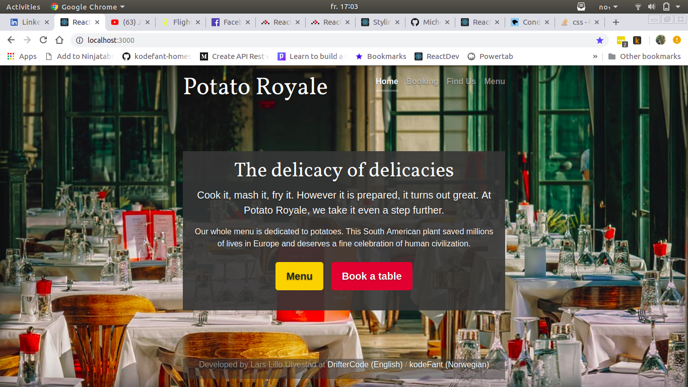

# 100 Days Of Code - Log

### Day 1: October 1st, 2018

#####

**Today's Progress:** Fixed some CSS on DrifterCode.com/kodefant.no, my bilingual Blog about web sites, communications and programming. I will from now on only call it DrifterCode since that is the English version. Both the Norwegian and English site is managed through the same WordPress install through the [WPML Plugin](https://wpml.org/).

DrifterCode is made with the Full [Roots Stack](https://roots.io/) including a Trellis server, the Bedrock boilerplate and the Sage 9 starter them with modern developer workflow like Webpack and Laravel Blade templating.

**Thoughts:** I initially made my Trellis install on a Mac several weeks ago, but wanted to continue developing it on my Ubuntu Linux machine. I pulled the code through the git repository and had some issues with some error messages about SSH and NFS. I managed to fix it, but it took a couple of hours to work out.

Battling configurations errors can test the patience of a guy just wanting to code. Still, all these tools are very powerful, open source and free, so I am very thankful. But when I google for fixes, I often end up on tutorials with lots of terminal commands. And some errors were because I configured my Linux installation with encryption on **/home**.

It sometimes feels like the need for all these guides signifies a bug that no one will claim. I think this applies to how the different technologies interact, so these things are probably not easy to solve for the developers. This must be challenging when working with DevOps, but I guess the DevOps engineers learn to live with these challenges.

Just to be clear, these tools are actually amazing, free and open source.

**Plans for tomorrow:** I want to start building a conceptual restaurant app. I think I will try building it with WordPress REST API and React on the Front End.

**Link to work:** [DrifterCode.com](https://driftercode.com), [kodeFant.no](https://kodefant.no) and [The Github repository](https://github.com/kodeFant/wp_kodefant)

### Day 2: October 2nd, 2018

#####

**Today's Progress:** I decided to work on making the CSS Grids on my site [DrifterCode (eng)](https://driftercode.com)/[kodeFant (no)](https://kodefant.no) work on Internet Explorer 11. It was a dreadful, but I finally made it work on post-view and blog list. Lots of credit goes to this [CSS-Tricks and their series about Grid in IE](https://css-tricks.com/css-grid-in-ie-debunking-common-ie-grid-misconceptions/).

I chose to completely replace my auto-placement grid for Blog Posts with Flexbox as it did the excact same thing. I adapted the technique in part three of that CSS-Tricks series.

**Thoughts:** It was a big effort making the CSS grid work with IE11, even when using autoprefixer with their grid support enables. 

I want to support IE11 because about [10 percent of Norwegians use IE](http://gs.statcounter.com/browser-market-share/all/norway), and lots of them are in large organisations. I of course want to make a good impression on these organisations.

It's not fun adding support to IE11, but I think I learned something today that can be valuable in the time to come.

I have chosen not to add the Bootstrap to my website. It makes stuff including grid easyer, but I wanted to really improve my skills on CSS.

The upside to the hardships of today is that I found a fun CSS Grid Game: [Grid Garden](http://cssgridgarden.com/) :)

**Plans for tomorrow:** I discovered that my pages-view on DrifterCode.com displays really poorly on IE11, so I will continue on that before moving on to a new project.

**Link to work:** [DrifterCode.com](https://driftercode.com), [kodeFant.no](https://kodefant.no) and [The Github repository](https://github.com/kodeFant/wp_kodefant)

### Day 3: October 3rd, 2018

#####

**Today's Progress:** Short workday today as I am sitting on the bus to Gothenburg for a small trip. Had some connection troubles so decided to postpone IE11 optimization and start building on my restaurant app. I started a new create-react-app project and set up some markup in JSX. I also decided to go with Bootstrap on this one.

**Thoughts:** It feels good to build with React again after a long period of WordPress. I am still not totally decided on WP REST API og Laravel for the back end, but I thin I want to try WP REST API to test how well it runs with React.

**Plans for tomorrow:** Taking the bus back home to Oslo. Will probably continue on the Restaurant app then.

**Link to work:** Deployment not yet ready yet. I have a [Github repository](https://github.com/kodeFant/restaurant-app)

### Day 4: October 4th, 2018

#####

**Today's Progress:** Heading home for Oslo today. Had only time to code on the bus. I familiarized myself with Reactstrap for using Bootstrap component in React. I really liked it. It seems like a timesaver and it has ready-made bootstrap component that I can freely modify. Loving it.

**Thoughts:** After doing custom CSS for a while, it feels like Bootstrap makes things really quick, but requires you to do a lot of styling over that again t avoid the "bootstrappy" look. Still, it is still a great time-saver for projects that needs a user interface pretty fast.

**Plans for tomorrow:** Returning to IE11 optimization on my current blog. Will probably also deploy early version of the Restaurant app.

**Link to work:** Deployment not yet ready yet for the restaurant app. I have a [Github repository](https://github.com/kodeFant/restaurant-app)

### Day 5: October 5th, 2018

#####

**Today's Progress:** Fixed my CSS Grid IE11 Support on pages. It was pretty easy as I had already done the work for posts. I also started creating a pretty nice layout on my Restaurant App, with Bootstrap.

**Thoughts:** Back in Oslo and ready to put in some serious hours of coding.

It was relieving to test my blog and see that it looks pretty good with IE11 with CSS Grid. I think the CSS Grid will totally replace the Bootstrap Grid System for me.

Even though I think custom CSS is great and more fun, I am using Bootstrap on my restaurant app. It adds speed to the development process of a user interface and I think some clients would appreciate that.

**Plans for tomorrow:** Countinue on the restaurant app, and maybe get to deploy an early version.

**Link to work:** [kodefant.no](https://kodefant.no) and [driftercode.com](https://driftercode.com) Deployment not yet ready for the restaurant app. I have a [Github repository](https://github.com/kodeFant/restaurant-app) for it.

### Day 6: October 6th, 2018

#####

**Today's Progress:** Slow progress today. Did some small patchwork in React, but nothing special.

**Thoughts:** Don't write the wrong password too many times via ssh on your site. You will be banned from yourself.

**Plans for tomorrow:** Restaurant app. Planning to finish it by next week.

**Link to work:** [Restaurant app](https://github.com/kodeFant/restaurant-app)

### Day 7: October 7th, 2018

#####

**Today's Progress:** Played around with Bootstrap 4 and finally managed deploying the React build.

Don't write the wrong password too maDon't write the wrong password too many times via ssh on your site. You will be banned from yourself.ny times via ssh on your site. You will be banned from yourself.

**Thoughts:** Deploying the React App wasn't really hard, but I did not really see the point of the serve command for running the build version on my CPanel managed server. Luckily, I had SSH access and node, so it worked. React should be deployed.

I have been doing some thinking on how I should solve the backend on a very simple app like this. WordPress REST API with Advanced Custom Fields should work find, but I am wondering if WordPress is at all necessary.

I might do it in Laravel and make a CMS with Laravel Voyager.

I also like the thought of learning GraphQL, but I am not sure I like the GraphCMS Pricing Model. Then I would rather use [WPGraphQL](https://wpgraphql.com/) as it also would lessen the server load by being very specific on the queries. I could also use Laravel with GraphQL, but I would also like a quick CMS dashboard for the end user.

**Plans for tomorrow:** Will continue on the restaurant app. Will need to figure out which backend solution I will want to use.

**Link to work:** [Restaurant app](https://github.com/kodeFant/restaurant-app)

### Day 8: October 8th, 2018

#####

**Today's Progress:** Worked with Bootstrap and React on Restaurant App. Did some research on restaurant booking and started working on a chart for a blog post with Chart.js.

**Thoughts:** I am realizing that even though React is a good library for maintaining the front end, I would not use it for small projects requiring small tasks just yet. So I am considering porting the restaurant app to WordPress instead of overengineering a simple app.

**Plans for tomorrow:** Had some front end bugs on my wordpress site, so will try to fix that.

### Day 9: October 9th, 2018

#####

**Today's Progress:** Fixed issue with width on mobile view on a blog post. I assumed it was the video, and that frustrated me because I believed it was fixed. Luckily, I found out after not too long it was a too long word in a blockquote. I fixed it with the CSS word-break-property. What would I do without Chrome's Developer tools?

I have tried to make a Chart.js bar chart responsive, but neither the documentation nor Stack Overflow could help me.

**Thoughts:** Wondering if I should learn D3 for charts. I think it would be fun to make custom charts for other people, and it would aid my journalism skills.

**Plans for tomorrow:** Figure out how to make a proper responsive chart and finish my bar chart for my new blog post.

**Link to work:** [DrifterCode.com](https://driftercode.com)

### Day 10: October 10th, 2018

#####

**Today's Progress:** Short day of coding today. Continued tinkering with Charts.js. Tried to figure out if it had something to do with CSS Grid, but it did not. I probably need to force it with a width of 100% with JavaScript, but did not have time for it today.

**Thoughts:** I have had lots of troubles with elements not respecting parent with. Must be a common pain point of CSS.

**Plans for tomorrow:** Fix chart with JavaScript and finish blog post about testing IE11 on Mac or Linux.

### Day 11: October 15th, 2018

#####

*Unfortunately, I had a couple of sick days, and was not able to code. I choose to continue my "streak" even though it will contain a hole.*

**Today's Progress:** Ditched charts.js and replaced it with [Apexcharts](https://apexcharts.com/) on my blog. This was great, and worked just as well with no resposiveness-issues. I also managed to do a CSS-fix on images with captions not respecting the max-width of the parent element.

**Thoughts:** An upside to being forced to take a couple of days off, was that I discovered a new charts library that was better for my use. I am also deciding to use templates and frameworks more as I feel like I have got the fundamentals of modern CSS down now.

**Plans for tomorrow:** Continue on making a restaurant app, and make some decisions on the infrastructure.

**Link to work:** [My Blog Post in Norwegian (English version not ready yet)](https://kodefant.no/slik-tester-du-internet-explorer-med-mac/)

### Day 12: October 16th, 2018

#####

**Today's Progress:** Got familiar with CSS Modules on Create React App 2. I also decided to start my restaurant App anew and think of it as a front-end project and not think too much about the back-end, as i would not have so much to show for on a simple app like this anyway. I decided yet again to do it with React to get the practice. I could have improved on the existing, but it was so early anyway, so it doesn't matter.

**Thoughts:** I have been feeling like not getting progress at the pace I would wish. So I will now plan for launching my projects at my site at a very early stage, like Minimal Viable Products. I can improve on these later, so I need not make them perfect at first attempt.

**Plans for tomorrow:** Will make a nice front page for new restaurant app with CSS Animations.

**Link to work:** [New Restaurant App)](https://github.com/kodeFant/potato-royale)

### Day 13: October 17th, 2018

#####

**Today's Progress:** I continued to implement CSS Modules on a Bookmark App I am making in Laravel and React. Replacing SCSS with CSS Modules feels very good. I also worked on implementning prism syntax highlighting on my Blog. What always hits me on the blog is that all new elements I implement have issues with respecting viewport width. I wish I knew why.

**Thoughts:** I have decided to write a Blog post about quickly getting started on CSS modules. It's so easy when it works out of the box with CRA2.

**Plans for tomorrow:** Finish Blog Post about CSS Modules and do front end work on my full stack bookmark app.

**Link to work:** [New Restaurant App)](https://github.com/kodeFant/potato-royale)